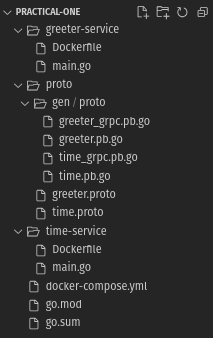
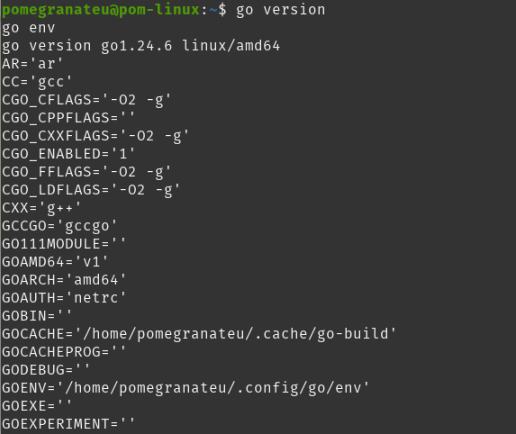
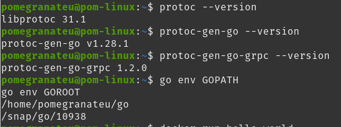
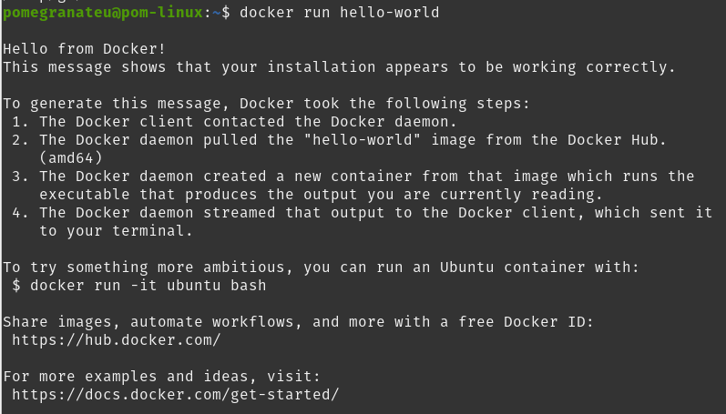
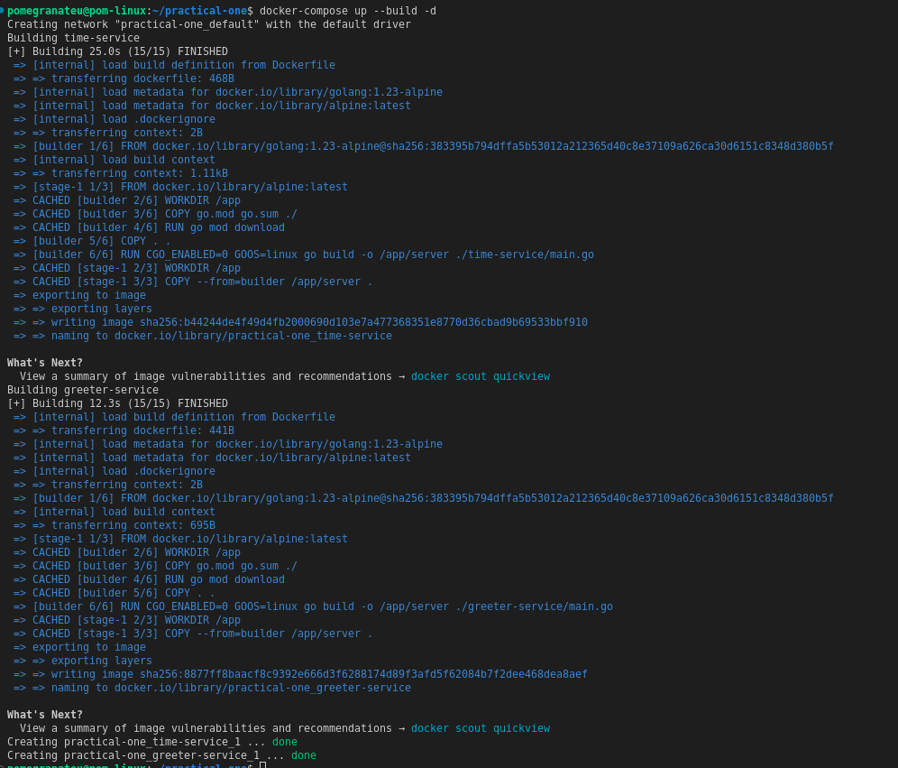
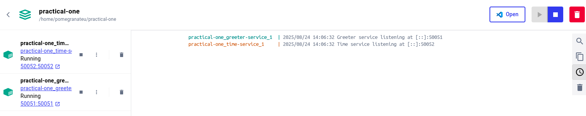
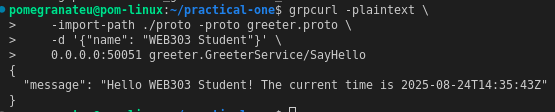

# WEB303 Practical 1: From Foundational Setup to Inter-Service Communication

**Repository LINK:** [https://github.com/pomegranateis/practical-one](https://github.com/pomegranateis/practical-one)

## Overview

This practical demonstrates the foundational setup of a microservices development environment and the implementation of inter-service communication using gRPC and Protocol Buffers. The project consists of two communicating microservices containerized with Docker and orchestrated using Docker Compose.

## Learning Outcomes Addressed

- **Learning Outcome 2**: Design and implement microservices using gRPC and Protocol Buffers for efficient inter-service communication
- **Learning Outcome 6**: Deploy microservices to containers as a foundational step towards Kubernetes orchestration
- **Learning Outcome 1**: Understand fundamental concepts of microservices architecture, including service discovery and communication patterns

## Architecture Overview

```
External Request → Greeter Service (gRPC Server) → Time Service (gRPC Server)
                        ↓
                   Docker Network Communication
                        ↓
                   Combined Response with Greeting + Current Time
```

### System Components

1. **Time Service**: A gRPC server that provides current timestamp functionality
2. **Greeter Service**: A gRPC server that acts as both server (for external requests) and client (calls Time Service)
3. **Protocol Buffers**: Define service contracts for type-safe communication
4. **Docker Compose**: Orchestrates multi-container application deployment

## Project Structure



## Part 1: Development Environment Setup

### Prerequisites Installation

#### 1.1 Go Programming Language


#### 1.2 Protocol Buffers & gRPC Tools


#### 1.3 Docker Installation


## Part 2: Microservices Implementation

### 2.1 Service Contract Definition

#### Time Service Contract (`proto/time.proto`)
```protobuf
syntax = "proto3";
option go_package = "practical-one/proto/gen;gen";
package time;

service TimeService {
  rpc GetTime(TimeRequest) returns (TimeResponse);
}

message TimeRequest {}
message TimeResponse {
  string current_time = 1;
}
```

#### Greeter Service Contract (`proto/greeter.proto`)
```protobuf
syntax = "proto3";
option go_package = "practical-one/proto/gen;gen";
package greeter;

service GreeterService {
  rpc SayHello(HelloRequest) returns (HelloResponse);
}

message HelloRequest {
  string name = 1;
}
message HelloResponse {
  string message = 1;
}
```

#### Code Generation
```bash
protoc --go_out=./proto/gen --go_opt=paths=source_relative \
    --go-grpc_out=./proto/gen --go-grpc_opt=paths=source_relative \
    proto/*.proto
```

### 2.2 Service Implementation

#### Time Service Features
- **Port**: 50052
- **Functionality**: Returns current time in RFC3339 format
- **Technology**: Pure gRPC server implementation
- **Dependencies**: Standard Go libraries + gRPC

#### Greeter Service Features  
- **Port**: 50051
- **Functionality**: 
  - Receives greeting requests
  - Makes gRPC calls to Time Service
  - Combines greeting with current time
- **Technology**: gRPC server + gRPC client (dual role)
- **Service Discovery**: Uses Docker networking (`time-service:50052`)

### 2.3 Containerization Strategy

#### Multi-Stage Docker Build
Both services use optimized multi-stage builds:
1. **Builder Stage**: Go compilation in full golang:alpine image
2. **Runtime Stage**: Minimal alpine:latest with only the binary
3. **Benefits**: Reduced image size, improved security

#### Docker Compose Orchestration
```yaml
version: '3.8'
services:
  time-service:
    build:
      context: .
      dockerfile: time-service/Dockerfile
    hostname: time-service

  greeter-service:
    build:
      context: .
      dockerfile: greeter-service/Dockerfile
    hostname: greeter-service
    ports:
      - "50051:50051"
    depends_on:
      - time-service
```

## Testing and Verification

### System Startup
```bash
docker-compose up --build
```




### End-to-End Testing

#### Using grpcurl
```bash
grpcurl -plaintext \
    -import-path ./proto -proto greeter.proto \
    -d '{"name": "WEB303 Student"}' \
    0.0.0.0:50051 greeter.GreeterService/SayHello
```

**Response**:



#### Alternative Testing Methods
1. **Direct gRPC Client**: Custom Go client implementation
2. **Postman**: With gRPC support enabled
3. **BloomRPC**: Dedicated gRPC testing tool

## Technical Implementation Details

### Inter-Service Communication
- **Protocol**: gRPC over HTTP/2
- **Service Discovery**: Docker internal DNS resolution
- **Network**: Docker Compose default bridge network
- **Security**: Insecure credentials for development (production would use TLS)

### Error Handling
- Connection failures logged and propagated
- Graceful service shutdown on container stop
- Context-aware request handling

### Performance Considerations
- Binary serialization via Protocol Buffers
- HTTP/2 multiplexing for efficient communication
- Minimal container images for faster deployment

## Challenges Encountered

### 1. Protocol Buffer Code Generation
**Challenge**: Initial confusion with protoc command syntax and path configurations
**Solution**: 
- Used source_relative paths for cleaner imports
- Ensured consistent go_package declarations
- Verified protoc plugins were properly installed

### 2. Docker Networking
**Challenge**: Greeter service couldn't connect to Time service initially
**Solution**: 
- Used service names as hostnames (`time-service:50052`)
- Ensured proper depends_on configuration in docker-compose
- Verified container networking with docker network inspect

### 3. Go Module Dependencies
**Challenge**: Import path conflicts between local proto files and external dependencies
**Solution**:
- Used consistent module naming (`practical-one/proto/gen`)
- Properly structured go.mod files in each service
- Ensured clean separation of generated code

### 4. Build Context Configuration  
**Challenge**: Dockerfile couldn't access proto files from service subdirectories
**Solution**:
- Set build context to root directory in docker-compose.yml
- Adjusted COPY commands in Dockerfiles accordingly
- Maintained proper file structure for multi-service builds

## Key Learnings

### 1. gRPC Advantages
- **Type Safety**: Protocol Buffers ensure contract compliance
- **Performance**: Binary serialization and HTTP/2 efficiency  
- **Language Agnostic**: Easy to add services in different languages
- **Streaming**: Built-in support for bidirectional streaming

### 2. Container Orchestration Benefits
- **Service Isolation**: Each service runs in its own container
- **Network Management**: Docker Compose handles service discovery
- **Dependency Management**: Explicit service startup ordering
- **Development Efficiency**: Single command deployment

### 3. Microservices Communication Patterns
- **Service-to-Service**: Direct gRPC communication
- **Contract-First Design**: Proto files define clear interfaces
- **Loose Coupling**: Services only know about contracts, not implementations
- **Fault Isolation**: Individual service failures don't cascade

### 4. Development Workflow Insights
- **Code Generation**: Automated stub generation saves development time
- **Multi-Stage Builds**: Production-ready containers with minimal overhead
- **Local Development**: Docker Compose simplifies complex deployments
- **Testing Strategy**: Multiple testing approaches for different scenarios

## Repository Information

This practical work is maintained in a public GitHub repository as required for WEB303 module submissions. The implementation demonstrates foundational microservices concepts and serves as a stepping stone toward more advanced distributed system patterns.

---

**Final Outcome**: Successfully implemented a multi-service application demonstrating gRPC inter-service communication, containerization, and orchestration. The system provides a foundation for understanding microservices architecture and prepares for more advanced topics like service discovery, load balancing, and Kubernetes deployment.