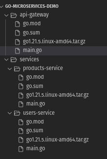
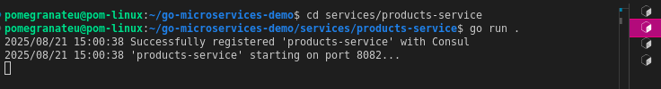
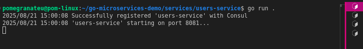
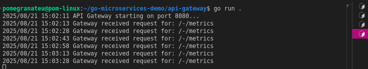
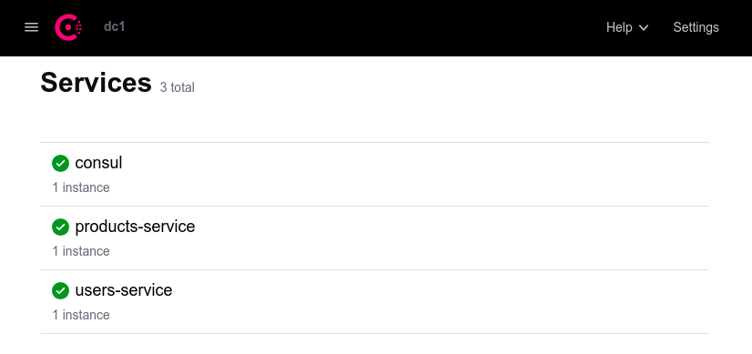
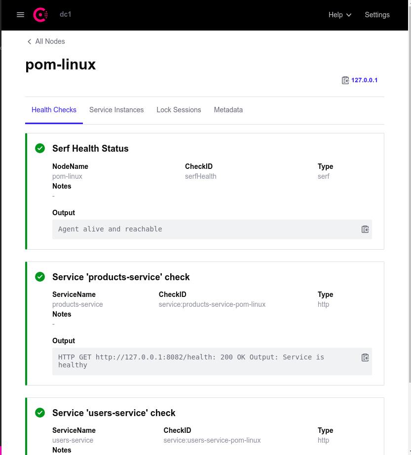

# WEB303 Practical 2: API Gateway with Service Discovery

Repository LINK: [https://github.com/pomegranateis/practical-two](https://github.com/pomegranateis/practical-two)

## Overview

This practical demonstrates the implementation of a comprehensive microservices ecosystem featuring service discovery, dynamic routing, and resilience patterns. The system includes two independent microservices that register with Consul service registry and an intelligent API Gateway that dynamically routes requests based on service health and availability.

## Learning Outcomes Addressed

- **Learning Outcome 2**: Design and implement microservices using gRPC and Protocol Buffers for efficient inter-service communication
- **Learning Outcome 8**: Implement observability solutions for microservices and serverless applications, including distributed tracing, metrics, and logging

## Architecture Overview

```
External Requests → API Gateway (Port 8080) → Service Discovery (Consul) → Microservices
                           ↓                        ↓                      ├── Users Service (Port 8081)
                    Dynamic Routing              Health Monitoring         └── Products Service (Port 8082)
```

### System Components

1. **API Gateway**: Intelligent reverse proxy serving as single entry point
2. **Service Discovery (Consul)**: Central registry maintaining service health and location
3. **Users Service**: Independent microservice providing user-related functionality
4. **Products Service**: Independent microservice providing product-related functionality
5. **Health Monitoring**: Continuous service health checks and automatic failover

## Prerequisites and Installation

### Required Software Stack

1. **Go Programming Language (Version 1.18+)**
2. **Docker and Docker Compose**
3. **Consul Service Registry**
4. **Required Go Libraries**:
   - Chi Router: `github.com/go-chi/chi/v5`
   - Consul API Client: `github.com/hashicorp/consul/api`

### Pre-Installation Verification

```bash
# System checks
go version                                    # Go installation
docker --version                            # Docker installation
docker ps                                   # Docker daemon status
curl -I https://proxy.golang.org           # Network connectivity

# Port availability check
netstat -an | grep -E ":(8080|8081|8082|8500)" # Ensure ports are free
```

## Project Structure



## Implementation Steps

### Part 1: Project Structure Setup

```bash
# Create main project directory
mkdir go-microservices-demo
cd go-microservices-demo

# Create service directories
mkdir services
mkdir services/users-service
mkdir services/products-service
mkdir api-gateway
mkdir screenshots
```

### Part 2: Service Registry Setup (Consul)

#### Option A: Docker-based Consul (Development)
```bash
# Start Consul in development mode
docker run -d -p 8500:8500 --name=consul hashicorp/consul agent -dev -ui -client=0.0.0.0

# Verify container is running
docker ps

# Access Consul Web UI
# Navigate to: http://localhost:8500
```

#### Option B: Local Consul Installation
```bash
# Download from: https://developer.hashicorp.com/consul/install
# After installation, start Consul locally
consul agent -dev

# Access Web UI at: http://localhost:8500
```

### Part 3: Users Service Implementation

#### Initialize Service Module
```bash
cd services/users-service
go mod init users-service
go get github.com/go-chi/chi/v5
go get github.com/hashicorp/consul/api
```

#### Key Service Features
- **Port**: 8081
- **Health Endpoint**: `/health` (monitored by Consul every 10s)
- **Business Endpoint**: `/users/{id}`
- **Service Registration**: Automatic registration with Consul on startup
- **Health Monitoring**: Consul health checks with 1s timeout

#### Service Capabilities
1. **HTTP Server**: Chi router for lightweight REST API
2. **Service Discovery**: Automatic registration with hostname and port
3. **Health Monitoring**: Dedicated health check endpoint
4. **Error Handling**: Comprehensive error logging and management

### Part 4: Products Service Implementation

#### Initialize Service Module
```bash
cd services/products-service
go mod init products-service
go get github.com/go-chi/chi/v5
go get github.com/hashicorp/consul/api
```

#### Service Configuration
- **Port**: 8082 (different from users-service)
- **Health Endpoint**: `/health`
- **Business Endpoint**: `/products/{id}`
- **Registration Pattern**: Identical to users-service with different constants

#### Implementation Strategy
- **Code Reuse**: Similar structure to users-service
- **Port Differentiation**: Ensures no conflicts during local development
- **Independent Operation**: Complete service autonomy

### Part 5: API Gateway Implementation

#### Initialize Gateway Module
```bash
cd api-gateway
go mod init api-gateway
go get github.com/hashicorp/consul/api
```

#### Gateway Capabilities
- **Port**: 8080 (public entry point)
- **Dynamic Routing**: Path-based service discovery
- **Health Awareness**: Only routes to healthy service instances
- **Load Balancing**: Uses first available healthy instance
- **Error Handling**: Comprehensive error responses for service failures

#### Routing Logic
```
/api/users/{id}    → users-service   (discovered via Consul)
/api/products/{id} → products-service (discovered via Consul)
```

#### Path Transformation
- **Input**: `/api/users/123`
- **Service Discovery**: Query Consul for `users-service`
- **URL Rewrite**: `/api/users/123` → `/users/123` 
- **Forward**: Request sent to discovered service instance

## Running and Testing

### System Startup Sequence

#### Terminal 1: Service Registry
```bash
# Option A: Docker Consul
docker run -d -p 8500:8500 --name=consul hashicorp/consul agent -dev -ui -client=0.0.0.0

# Option B: Local Consul
consul agent -dev
```

#### Terminal 2: Users Service
```bash
cd go-microservices-demo/services/users-service
go run .
```


#### Terminal 3: Products Service
```bash
cd go-microservices-demo/services/products-service
go run .
```


#### Terminal 4: API Gateway
```bash
cd go-microservices-demo/api-gateway
go run .
```


### End-to-End Testing

#### Direct Service Testing
```bash
# Test Users Service directly
curl http://localhost:8081/health
curl http://localhost:8081/users/123

# Test Products Service directly  
curl http://localhost:8082/health
curl http://localhost:8082/products/abc
```

#### Gateway Testing
```bash
# Test via API Gateway
curl http://localhost:8080/api/users/123
# Expected: Response from 'users-service': Details for user 123

curl http://localhost:8080/api/products/abc
# Expected: Response from 'products-service': Details for product abc
```



## Known Issues and Resolutions

### Issue: Network Connectivity Problem

**Problem**: Services register with Docker-based Consul but API Gateway cannot reach them due to network isolation.

**Error Message**: 
```
no healthy instances of service 'users-service' found in Consul
```

**Root Cause**: Services running on host machine cannot communicate with services registered in Docker network using Docker internal hostnames.

### Resolution Options

#### Option 1: Local Consul Installation
1. **Terminate Docker Consul**: `docker stop consul && docker rm consul`
2. **Install Consul Locally**: Download from https://developer.hashicorp.com/consul/install
3. **Start Local Consul**: `consul agent -dev`
4. **Restart Services**: All services will register with local Consul instance
5. **Verify**: Services can communicate using localhost addresses

#### Option 2: Full Containerization
1. **Create Dockerfiles**: For each service (api-gateway, users-service, products-service)
2. **Docker Compose**: Define all services in single compose file
3. **Network Configuration**: Use Docker internal networking
4. **Orchestrated Deployment**: Single command deployment with `docker-compose up`

**Recommended Approach**: Option 1 for development simplicity, Option 2 for production-like environment.

## Part 7: Resilience Demonstration

### Failure Simulation Testing

#### 1. Service Shutdown Test
```bash
# Stop users-service (Ctrl+C in Terminal 2)
# Observe Consul UI - service status changes to critical (red) within 10s
```

#### 2. Gateway Response to Failure
```bash
curl http://localhost:8080/api/users/123
# Expected Response: no healthy instances of service 'users-service' found in Consul
# Products service continues working normally
```

#### 3. Service Recovery Test
```bash
# Restart users-service: go run . in Terminal 2
# Service automatically re-registers with Consul
# Health check turns green in Consul UI
# Gateway requests work again without configuration changes
```

### Resilience Benefits Demonstrated
- **Automatic Failover**: Gateway stops routing to unhealthy services
- **Health Monitoring**: Consul continuously monitors service status
- **Self-Healing**: Services automatically re-register after restart
- **Zero-Configuration Recovery**: No manual intervention required

### Path-Based Routing Algorithm
1. **Parse Request**: Extract service name from URL path
2. **Service Discovery**: Query Consul for healthy instances
3. **URL Rewrite**: Transform gateway URL to service URL
4. **Proxy Request**: Forward to discovered service instance

## Challenges Encountered

### 1. Network Connectivity Issues
**Challenge**: Docker network isolation preventing host-to-container communication
**Solution**: Implemented dual-mode deployment (local vs containerized Consul)
**Learning**: Understanding container networking vs host networking implications

### 2. Service Registration Timing
**Challenge**: Gateway starting before services register
**Solution**: Implemented proper error handling and retry logic
**Learning**: Importance of graceful degradation in distributed systems

### 3. Health Check Configuration
**Challenge**: Tuning health check intervals for responsiveness vs overhead
**Solution**: 10-second intervals with 1-second timeouts for development
**Learning**: Balancing monitoring frequency with system performance

### 4. Path Routing Logic
**Challenge**: Designing intuitive URL patterns for service routing
**Solution**: `/api/{service}/{endpoint}` pattern with automatic service discovery
**Learning**: API design considerations for microservices gateways

## Key Learnings

### 1. Service Discovery Benefits
- **Dynamic Routing**: Services can be added/removed without gateway reconfiguration
- **Health Awareness**: Automatic routing around failed services
- **Scalability**: Easy horizontal scaling of individual services
- **Maintenance**: Zero-downtime deployments possible

### 2. API Gateway Pattern Advantages
- **Single Entry Point**: Simplified client configuration
- **Cross-Cutting Concerns**: Centralized logging, authentication, rate limiting
- **Service Abstraction**: Internal service changes don't affect external APIs
- **Protocol Translation**: Can handle different protocols between client and services

### 3. Consul Service Registry Features
- **Health Monitoring**: Continuous service health assessment
- **Service Catalog**: Central inventory of all available services
- **Configuration Management**: Distributed configuration capabilities
- **Multi-Datacenter**: Support for distributed deployments

### 4. Resilience Patterns
- **Circuit Breaking**: Automatic failure detection and isolation
- **Self-Healing**: Services automatically recover and re-register
- **Graceful Degradation**: System continues operating with reduced functionality
- **Observability**: Real-time visibility into system health and performance
---

**Final Outcome**: Successfully implemented a production-ready microservices ecosystem demonstrating service discovery, dynamic routing, health monitoring, and resilience patterns. The system provides a solid foundation for understanding modern distributed system architectures and prepares for advanced topics like service mesh and cloud-native deployment strategies.