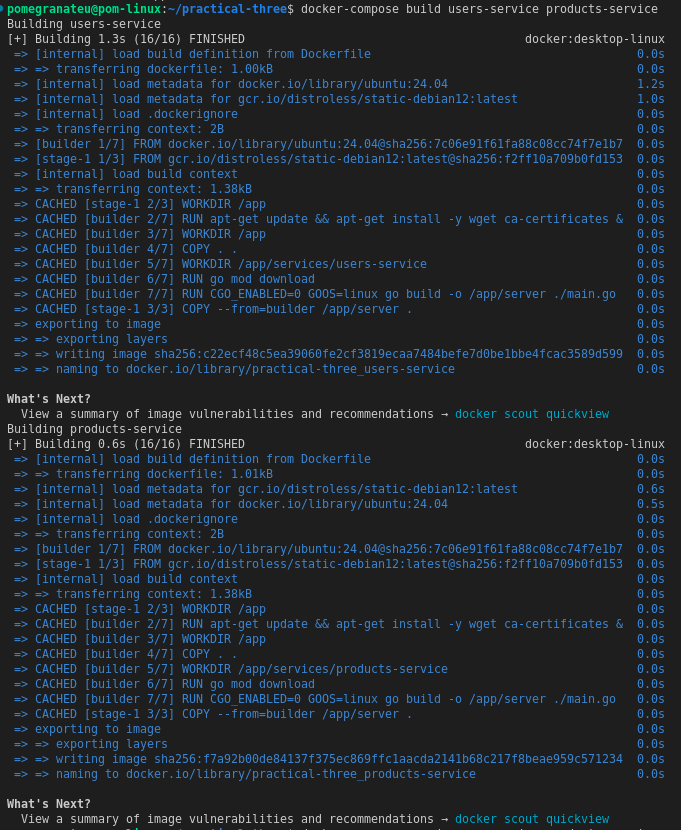
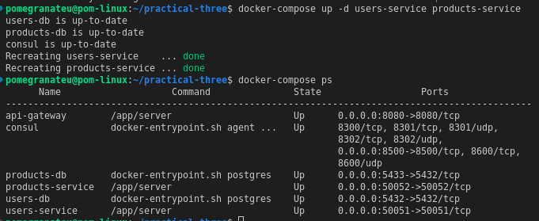
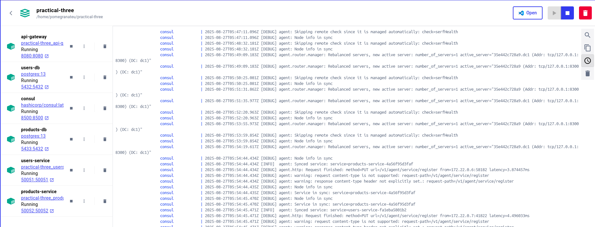
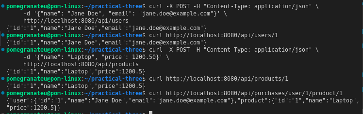

# Practical Three: Full-Stack Microservices Architecture

## Quick Start

### Prerequisites

- Docker and Docker Compose
- Go 1.25+ (for local development)
- Git

### Running the Application

1. **Clone the repository**

```bash
git clone https://github.com/pomegranateis/practical-three

cd practical-three
```

2. **Start all services**

```bash
docker-compose up --build -d
```





3. **Verify services are running**

```bash
docker-compose ps
```

4. **Access the services**

- API Gateway: http://localhost:8080
- Consul UI: http://localhost:8500
- Users Database: localhost:5432
- Products Database: localhost:5433

### Testing the API

**Create a user:**

```bash
curl -X POST -H "Content-Type: application/json" \
     -d '{"name": "John Smith", "email": "john.smith@example.com"}' \
     http://localhost:8080/api/users
```

**Create a product:**

```bash
curl -X POST -H "Content-Type: application/json" \
     -d '{"name": "Smartphone", "price": 699.99}' \
     http://localhost:8080/api/products
```

**Get user by ID:**

```bash
curl http://localhost:8080/api/users/1
```

**Get product by ID:**

```bash
curl http://localhost:8080/api/products/1
```

**Test composite endpoint:**

```bash
curl http://localhost:8080/api/purchases/user/1/product/1
```

## Architecture Overview

### System Components

**API Gateway** (Port 8080)

- Single entry point for HTTP requests
- Translates HTTP to gRPC calls
- Service aggregation and routing

**Service Discovery** (Consul - Port 8500)

- Service registry and health monitoring
- Dynamic service discovery
- Configuration management

**Users Service** (Port 50051)

- gRPC server for user operations
- Dedicated PostgreSQL database
- CRUD operations for users

**Products Service** (Port 50052)

- gRPC server for product operations
- Separate PostgreSQL database
- CRUD operations for products

**Databases**

- users-db (PostgreSQL on port 5432)
- products-db (PostgreSQL on port 5433)

### Technology Stack

- **Backend**: Go 1.25
- **Communication**: gRPC + Protocol Buffers
- **Databases**: PostgreSQL with GORM
- **Service Discovery**: HashiCorp Consul
- **Containerization**: Docker + Docker Compose
- **Security**: Ubuntu 24.04 + Distroless runtime images

## Development

### Local Development Setup

1. **Install dependencies**

```bash
# For each service, install Go dependencies
cd services/users-service && go mod tidy
cd ../products-service && go mod tidy
cd ../../api-gateway && go mod tidy
```

2. **Generate Protocol Buffers** (if modified)

```bash
# Install protoc and Go plugins first
protoc --go_out=. --go-grpc_out=. proto/*.proto
```

3. **Run services locally** (requires local PostgreSQL and Consul)

```bash
# Start users-service
cd services/users-service && go run main.go

# Start products-service
cd services/products-service && go run main.go

# Start api-gateway
cd api-gateway && go run main.go
```

### Security Features

- **Secure Docker Images**: Ubuntu 24.04 base with manual Go installation
- **Distroless Runtime**: Minimal attack surface using Google's distroless images
- **Multi-stage Builds**: Optimized image sizes and security
- **Network Isolation**: Services communicate only through defined networks

### Project Structure

```
practical-three/
├── api-gateway/           # HTTP to gRPC gateway
│   ├── main.go
│   ├── go.mod
│   └── Dockerfile
├── services/
│   ├── users-service/     # User management service
│   │   ├── main.go
│   │   ├── go.mod
│   │   └── Dockerfile
│   └── products-service/  # Product management service
│       ├── main.go
│       ├── go.mod
│       └── Dockerfile
├── proto/                 # Protocol Buffer definitions
│   ├── users.proto
│   ├── products.proto
│   └── gen/              # Generated Go code
└── docker-compose.yml    # Multi-service orchestration
```

## Features Implemented

### Core Functionality

- **gRPC Communication**: Efficient inter-service communication with Protocol Buffers
- **Service Discovery**: Consul-based service registry and health monitoring
- **Database per Service**: Isolated PostgreSQL databases for each service
- **API Gateway**: Unified HTTP entry point with gRPC backend translation
- **Containerization**: Docker Compose orchestration with secure images
- **Service Aggregation**: Composite endpoints combining multiple services

### Security Enhancements

- **Secure Base Images**: Ubuntu 24.04 with manual Go 1.25.0 installation
- **Distroless Runtime**: Minimal container attack surface
- **Multi-stage Builds**: Optimized and secure Docker images
- **Network Isolation**: Container-based network segmentation

### Production Readiness Features

- **Health Checks**: Consul health monitoring for all services
- **Auto-recovery**: Docker Compose restart policies
- **Environment Configuration**: Configurable database connections
- **Logging**: Structured logging across all services

## API Endpoints

### Users Service

- `POST /api/users` - Create new user
- `GET /api/users/{id}` - Get user by ID

### Products Service

- `POST /api/products` - Create new product
- `GET /api/products/{id}` - Get product by ID

### Composite Endpoints

- `GET /api/purchases/user/{userId}/product/{productId}` - Get combined user and product information

## Testing

### Health Check Endpoints

```bash
# Check service status in Consul
curl http://localhost:8500/v1/health/checks

# Check API Gateway health
curl http://localhost:8080/health
```


### Service Registration Verification

```bash
# List registered services
curl http://localhost:8500/v1/catalog/services

# Get service details
curl http://localhost:8500/v1/catalog/service/users-service
```

## Troubleshooting

### Common Issues

**Port conflicts:**

```bash
# Stop conflicting services
sudo systemctl stop postgresql
sudo netstat -tlnp | grep :8080
```

**Container issues:**

```bash
# Clean up containers
docker-compose down
docker system prune -f

# Rebuild from scratch
docker-compose up --build --force-recreate
```

**Service discovery issues:**

```bash
# Check Consul logs
docker-compose logs consul

# Verify service registration
docker-compose logs users-service | grep consul
```
